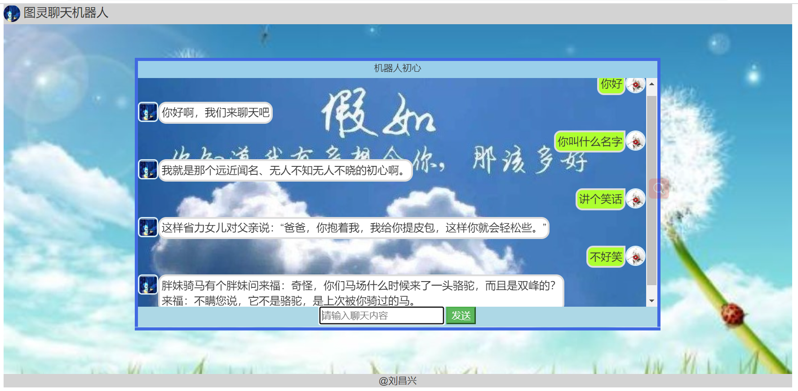
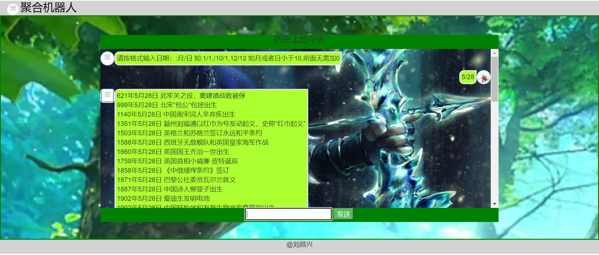

#### 介绍

这是一个基于前后端入门级项目，包括前端html，css，jsp，后端java编写的网页聊天项目。这个项目是作者在最初入门开发写的第一个项目，所以很长时间了，里面不仅有项目代码，还有各种测试demo，可以供入坑开发的小伙伴学习。最近发现使用的聚合数据接口都废弃了。。。

所以闲着没事重构了一下部分代码。这个项目是使用了第三方接口机器人来实现的人与机器人对话，而不是人和人。

**注意：**项目中图灵机器人以及聚合机器人的apiKey要换成自己申请的，需要替换的地方有标注。分别在TulingChat.jsp,TulingChat2.jsp,JuheChat.jsp中

#### 技术体系

前端：html、css、JavaScript、jQuery、bootstrap

后端：Java，tomcat、其中用到了jar包Hutool，gson

接口：图灵机器人：[图灵机器人-智能好用的聊天机器人 (turingapi.com)](http://www.turingapi.com/)

​			聚合数据：[API_API数据接口_免费数据调用_API接口平台-聚合数据 (juhe.cn)](https://www.juhe.cn/)

#### 项目截图

